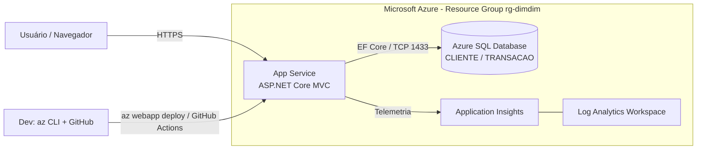

# PLANO — Projeto DimDim (2º Checkpoint · DevOps Tools & Cloud Computing)

> Documento de plano para ser colocado na raiz do repositório e seguido pelo Claude Code no VS Code.
> Stack decidida: **C# .NET (ASP.NET Core MVC)** + **Azure SQL Database** + **Azure App Service** + **Application Insights**.

---

## 1. Resumo do que o professor exige

**Aplicação**
- Web app em Java ou .NET, feita em grupo. **Não pode ser o projeto da Sprint 3.**
- Deploy **automatizado** com uma das técnicas: Azure CLI + GitHub Actions, **ou** Azure CLI + `az webapp deploy`.
- Monitoração com **Application Insights**.
- Tudo na nuvem (Azure). **Localhost = nota zero.**

**Banco**
- Somente **Azure SQL Server** (PaaS, não containerizado).
- Mínimo **2 tabelas relacionadas**, com **CRUD em cada uma**.

**Bônus**
- Tema DimDim **com front-end** (não pode ser só API) = **+1 ponto** no final.

**Entrega**
- Repositório no GitHub com: descrição da solução, desenho da arquitetura, DDL em `scripts/`, scripts do CLI em `scripts/`, código-fonte completo, How-to no `README.md`, (JSON das operações só se for API).
- Vídeo (mín. 720p, com explicação falada).
- PDF `<nome_grupo>_webapp.pdf` com: nome do grupo, RM e nome dos integrantes, link do GitHub, link do vídeo. **Nada além disso.**
- Upload no Teams **apenas pelo representante do grupo**.

---

## 2. Checklist de penalidades (revisar antes de entregar)

| Risco | Penalidade | Como evitar |
|---|---|---|
| Projeto da Sprint 3 | Nota zero | Projeto novo, tema DimDim |
| Rodando em localhost | Nota zero | Todo o vídeo mostra o app na URL `azurewebsites.net` |
| Professor sem acesso ao repo/vídeo | Nota zero | Repo **público** (ou professor convidado) e vídeo com link acessível; testar em aba anônima |
| Vídeo < 720p ou sem fala | -3 | Gravar em 1080p, narrando |
| Não mostrar cada operação no banco | -3 | Mostrar o banco (Query Editor) após cada create/update/delete, nas 2 tabelas |
| Faltar etapa no vídeo | -1 por etapa | Seguir o roteiro da seção 9 |
| Sem Application Insights | -1,5 | Mostrar telemetria no portal no vídeo |
| Sem How-to no GitHub | -1,5 | README completo (seção 10) |
| Sem scripts do CLI | -3 | Pasta `scripts/` |
| Só 1 tabela no CRUD | -3 | CRUD completo em `CLIENTE` e `TRANSACAO` |
| Não usar Azure SQL | -5 | Azure SQL Database |
| Sem código-fonte | -5 | — |
| Dados sensíveis no código | -1 | Nada de senha/connection string no repo (seção 8) |
| Sem DDL | -1 | `scripts/01-ddl.sql` |
| Sem descrição / sem arquitetura | -1 cada | Seções do README; arquitetura **de recursos Azure**, não fluxograma |
| PDF/Teams/pasta `scripts` fora do padrão | -0,5 | Nome exato `<nome_grupo>_webapp.pdf`, pasta `scripts` |

---

## 3. Ideia do app: DimDim Carteira

Web app MVC para gerenciar **clientes** e suas **transações de pagamento** (PIX, boleto, cartão).

Telas:
- Clientes: listar, criar, editar, detalhar, excluir.
- Transações: listar (com nome do cliente), criar (escolhendo o cliente), editar, detalhar, excluir.
- Página inicial com um resumo simples (total de clientes, total de transações, soma dos valores).

### Modelo de dados (relação 1:N)

```
CLIENTE (1) ───< (N) TRANSACAO
```

### DDL — `scripts/01-ddl.sql`

```sql
IF OBJECT_ID('dbo.TRANSACAO', 'U') IS NOT NULL DROP TABLE dbo.TRANSACAO;
IF OBJECT_ID('dbo.CLIENTE', 'U') IS NOT NULL DROP TABLE dbo.CLIENTE;

CREATE TABLE dbo.CLIENTE (
    Id            INT IDENTITY(1,1) NOT NULL CONSTRAINT PK_CLIENTE PRIMARY KEY,
    Nome          NVARCHAR(100)     NOT NULL,
    Email         NVARCHAR(150)     NOT NULL CONSTRAINT UQ_CLIENTE_EMAIL UNIQUE,
    Telefone      NVARCHAR(20)      NULL,
    DataCadastro  DATETIME2         NOT NULL CONSTRAINT DF_CLIENTE_DATA DEFAULT SYSUTCDATETIME()
);

CREATE TABLE dbo.TRANSACAO (
    Id             INT IDENTITY(1,1) NOT NULL CONSTRAINT PK_TRANSACAO PRIMARY KEY,
    ClienteId      INT               NOT NULL,
    Descricao      NVARCHAR(200)     NOT NULL,
    Valor          DECIMAL(18,2)     NOT NULL CONSTRAINT CK_TRANSACAO_VALOR CHECK (Valor > 0),
    Tipo           VARCHAR(20)       NOT NULL CONSTRAINT CK_TRANSACAO_TIPO CHECK (Tipo IN ('PIX','BOLETO','CARTAO')),
    Status         VARCHAR(20)       NOT NULL CONSTRAINT DF_TRANSACAO_STATUS DEFAULT 'PENDENTE'
                   CONSTRAINT CK_TRANSACAO_STATUS CHECK (Status IN ('PENDENTE','PAGO','CANCELADO')),
    DataTransacao  DATETIME2         NOT NULL CONSTRAINT DF_TRANSACAO_DATA DEFAULT SYSUTCDATETIME(),
    CONSTRAINT FK_TRANSACAO_CLIENTE FOREIGN KEY (ClienteId) REFERENCES dbo.CLIENTE(Id) ON DELETE CASCADE
);

CREATE INDEX IX_TRANSACAO_CLIENTE ON dbo.TRANSACAO(ClienteId);
```

> `ON DELETE CASCADE`: excluir um cliente exclui as transações dele. Mostrar isso no vídeo com cuidado (ou trocar por `NO ACTION` e bloquear exclusão com mensagem amigável).

---

## 4. Arquitetura

### Diagrama macro (recursos Azure)



**Entrega:** exportar este diagrama como imagem (`docs/arquitetura.png`, por exemplo via draw.io ou mermaid.live) e referenciar no README. O professor pede um desenho de **arquitetura**, então mostrar recursos, comunicação e fluxo de deploy; não fazer fluxograma de telas.

### Decisões técnicas

| Item | Decisão |
|---|---|
| Framework | ASP.NET Core MVC (versão LTS suportada pelo App Service; conferir com `az webapp list-runtimes --os linux`) |
| Acesso a dados | Entity Framework Core + provider SQL Server (`Microsoft.EntityFrameworkCore.SqlServer`) |
| Tabelas | Criadas pelo **DDL em `scripts/01-ddl.sql`** (executado com `sqlcmd`); EF apenas mapeia as tabelas |
| Telemetria | `Microsoft.ApplicationInsights.AspNetCore`, configurada via connection string em App Setting |
| Hospedagem | App Service Linux, plano B1 |
| Banco | Azure SQL Database, tier Basic, firewall liberando serviços Azure + IP do dev |
| Deploy | **Azure CLI + `az webapp deploy`** (principal). Opcional: workflow do GitHub Actions |
| Segredos | Nunca no repo. Local: `dotnet user-secrets`. Nuvem: App Settings do Web App / GitHub Secrets |

---

## 5. Estrutura do repositório

```
dimdim-carteira/
├── README.md                  # descrição, arquitetura, how-to completo
├── PLANO.md                   # este arquivo (pode remover antes de entregar)
├── .gitignore                 # ignora bin/, obj/, publish/, *.zip, appsettings.*.local.json, .env
├── docs/
│   └── arquitetura.png
├── scripts/
│   ├── 00-variaveis.sh        # nomes e variáveis (SEM senha)
│   ├── 01-ddl.sql             # DDL das tabelas
│   ├── 02-criar-recursos.sh   # RG, SQL, App Service, App Insights
│   ├── 03-aplicar-ddl.sh      # roda o DDL no Azure SQL
│   └── 04-deploy.sh           # publish + az webapp deploy
├── .github/workflows/
│   └── deploy.yml             # (opcional) GitHub Actions
└── src/
    └── DimDim.Web/
        ├── Controllers/       # HomeController, ClientesController, TransacoesController
        ├── Models/            # Cliente.cs, Transacao.cs
        ├── Data/              # AppDbContext.cs
        ├── Views/             # Home, Clientes, Transacoes, Shared
        ├── Program.cs
        └── appsettings.json   # sem segredos
```

---

## 6. Scripts do Azure CLI

> Pré-requisitos: `az login`, extensão `application-insights` (`az extension add -n application-insights`), `sqlcmd` instalado, `dotnet` SDK, `zip`.
> Os nomes de Web App e SQL Server precisam ser **únicos globalmente**: usar um sufixo (ex.: RM ou iniciais do grupo).

### `scripts/00-variaveis.sh`

```bash
#!/usr/bin/env bash
# Ajuste os valores. NÃO colocar senha aqui.
export SUFIXO="grupo01"                     # troque por algo único
export LOCATION="brazilsouth"               # ou eastus2, se faltar quota
export RG="rg-dimdim-${SUFIXO}"
export SQL_SERVER="sql-dimdim-${SUFIXO}"
export SQL_DB="dimdim-db"
export SQL_ADMIN="dimdimadmin"
export PLAN="plan-dimdim-${SUFIXO}"
export WEBAPP="app-dimdim-${SUFIXO}"
export LAW="law-dimdim-${SUFIXO}"
export APPINSIGHTS="ai-dimdim-${SUFIXO}"
export RUNTIME="DOTNETCORE:8.0"             # conferir com: az webapp list-runtimes --os linux

# A senha vem do ambiente (defina no terminal antes de rodar):
#   export SQL_PASSWORD='SuaSenhaForte#2026'
: "${SQL_PASSWORD:?Defina a variavel SQL_PASSWORD antes de rodar}"
```

### `scripts/02-criar-recursos.sh`

```bash
#!/usr/bin/env bash
set -euo pipefail
source "$(dirname "$0")/00-variaveis.sh"

echo ">> Resource Group"
az group create --name "$RG" --location "$LOCATION"

echo ">> Azure SQL Server + Database"
az sql server create \
  --name "$SQL_SERVER" --resource-group "$RG" --location "$LOCATION" \
  --admin-user "$SQL_ADMIN" --admin-password "$SQL_PASSWORD"

az sql db create \
  --name "$SQL_DB" --server "$SQL_SERVER" --resource-group "$RG" \
  --service-objective Basic

# Libera serviços do Azure (o Web App) a acessar o SQL
az sql server firewall-rule create \
  --server "$SQL_SERVER" --resource-group "$RG" \
  --name AllowAzureServices --start-ip-address 0.0.0.0 --end-ip-address 0.0.0.0

# Libera o IP da máquina de quem está rodando (para aplicar o DDL)
MEU_IP=$(curl -s https://api.ipify.org)
az sql server firewall-rule create \
  --server "$SQL_SERVER" --resource-group "$RG" \
  --name AllowMyIP --start-ip-address "$MEU_IP" --end-ip-address "$MEU_IP"

echo ">> Log Analytics + Application Insights"
az monitor log-analytics workspace create \
  --resource-group "$RG" --workspace-name "$LAW" --location "$LOCATION"

az monitor app-insights component create \
  --app "$APPINSIGHTS" --location "$LOCATION" --resource-group "$RG" \
  --workspace "$LAW" --kind web --application-type web

AI_CONN=$(az monitor app-insights component show \
  --app "$APPINSIGHTS" --resource-group "$RG" --query connectionString -o tsv)

echo ">> App Service Plan + Web App"
az appservice plan create \
  --name "$PLAN" --resource-group "$RG" --location "$LOCATION" \
  --is-linux --sku B1

az webapp create \
  --name "$WEBAPP" --resource-group "$RG" --plan "$PLAN" --runtime "$RUNTIME"

echo ">> Configuracoes do Web App (segredos ficam so no Azure)"
CONN="Server=tcp:${SQL_SERVER}.database.windows.net,1433;Initial Catalog=${SQL_DB};User ID=${SQL_ADMIN};Password=${SQL_PASSWORD};Encrypt=True;TrustServerCertificate=False;Connection Timeout=30;"

az webapp config connection-string set \
  --name "$WEBAPP" --resource-group "$RG" \
  --connection-string-type SQLAzure \
  --settings DefaultConnection="$CONN"

az webapp config appsettings set \
  --name "$WEBAPP" --resource-group "$RG" \
  --settings APPLICATIONINSIGHTS_CONNECTION_STRING="$AI_CONN"

echo ">> Pronto. URL: https://${WEBAPP}.azurewebsites.net"
```

### `scripts/03-aplicar-ddl.sh`

```bash
#!/usr/bin/env bash
set -euo pipefail
source "$(dirname "$0")/00-variaveis.sh"

sqlcmd -S "${SQL_SERVER}.database.windows.net" -d "$SQL_DB" \
  -U "$SQL_ADMIN" -P "$SQL_PASSWORD" -N \
  -i "$(dirname "$0")/01-ddl.sql"
```

### `scripts/04-deploy.sh`

```bash
#!/usr/bin/env bash
set -euo pipefail
source "$(dirname "$0")/00-variaveis.sh"

ROOT="$(cd "$(dirname "$0")/.." && pwd)"

dotnet publish "$ROOT/src/DimDim.Web" -c Release -o "$ROOT/publish"
(cd "$ROOT/publish" && zip -r ../publish.zip .)

az webapp deploy \
  --resource-group "$RG" --name "$WEBAPP" \
  --src-path "$ROOT/publish.zip" --type zip

echo ">> Deploy concluido: https://${WEBAPP}.azurewebsites.net"
```

### (Opcional) `.github/workflows/deploy.yml`

Alternativa/complemento com GitHub Actions. Secrets necessários no repo: `AZURE_WEBAPP_PUBLISH_PROFILE` (baixar com `az webapp deployment list-publishing-profiles --xml`) e, se quiser, nenhum outro, pois a connection string já está nas App Settings.

```yaml
name: Deploy DimDim
on:
  push:
    branches: [main]
  workflow_dispatch:

env:
  WEBAPP_NAME: app-dimdim-grupo01     # ajuste
  DOTNET_VERSION: "8.0.x"             # mesma versão do runtime do Web App

jobs:
  build-deploy:
    runs-on: ubuntu-latest
    steps:
      - uses: actions/checkout@v4
      - uses: actions/setup-dotnet@v4
        with:
          dotnet-version: ${{ env.DOTNET_VERSION }}
      - run: dotnet publish src/DimDim.Web -c Release -o publish
      - uses: azure/webapps-deploy@v3
        with:
          app-name: ${{ env.WEBAPP_NAME }}
          publish-profile: ${{ secrets.AZURE_WEBAPP_PUBLISH_PROFILE }}
          package: publish
```

---

## 7. Código: o que o Claude Code deve gerar

1. `dotnet new mvc -n DimDim.Web -o src/DimDim.Web`
2. Pacotes: `Microsoft.EntityFrameworkCore.SqlServer`, `Microsoft.ApplicationInsights.AspNetCore`.
3. **Models:** `Cliente` (Id, Nome, Email, Telefone, DataCadastro, `ICollection<Transacao>`) e `Transacao` (Id, ClienteId, Cliente, Descricao, Valor, Tipo, Status, DataTransacao), com validações (`[Required]`, `[StringLength]`, `[EmailAddress]`, `[Range]`).
4. **`AppDbContext`** mapeando para `CLIENTE` e `TRANSACAO` (`ToTable("CLIENTE")`, etc.), relação 1:N, `DeleteBehavior.Cascade`.
5. **`Program.cs`:** ler `ConnectionStrings:DefaultConnection`; `AddApplicationInsightsTelemetry()`; `AddDbContext` com `UseSqlServer` e `EnableRetryOnFailure()`.
6. **Controllers + Views** com CRUD completo (Index, Details, Create, Edit, Delete) para `Clientes` e `Transacoes`. Em `Transacoes`, dropdown de clientes.
7. **Home** com o resumo (contagens e soma).
8. Visual simples, tema amarelo/preto do DimDim, para reforçar o tema do bônus.
9. Logar eventos relevantes com `ILogger` (ex.: "Cliente criado", "Transação excluída") para aparecerem no Application Insights.

**Rodar local para desenvolver é OK** (user-secrets com a connection string do Azure SQL). Só a **entrega/vídeo** não pode ser em localhost.

---

## 8. Segurança (evitar -1 ponto)

- `.gitignore` com: `bin/`, `obj/`, `publish/`, `publish.zip`, `.env`, `*.local.json`, `*.pubxml`.
- `appsettings.json` **sem** connection string real (deixar vazia ou com placeholder).
- Local: `dotnet user-secrets init` e `dotnet user-secrets set "ConnectionStrings:DefaultConnection" "..."`.
- Scripts usam `$SQL_PASSWORD` do ambiente; nunca escrever a senha em arquivo versionado.
- Antes de cada push: `git grep -i -E "password|pwd|secret|token"` e revisar.
- Se uma senha vazar no histórico do git, **trocar a senha do SQL** e reescrever o histórico; não basta apagar no commit seguinte.

---

## 9. Roteiro do vídeo (1080p, narrado)

Cada etapa abaixo vale -1 se faltar.

1. **Abertura (30s):** nome do grupo, integrantes, objetivo, mostrar o diagrama de arquitetura.
2. **Criação dos recursos em nuvem:** rodar `02-criar-recursos.sh` e depois mostrar no portal: Resource Group, SQL Server/Database, App Service, Application Insights.
3. **Banco:** rodar `03-aplicar-ddl.sh` e mostrar as tabelas no Query Editor do portal.
4. **Deploy sendo efetuado:** rodar `04-deploy.sh` (ou mostrar o GitHub Actions rodando) e abrir a URL `azurewebsites.net`.
5. **Testes com persistência (o ponto de -3):** para **CLIENTE** e para **TRANSACAO**, fazer:
   - Create → `SELECT * FROM ...` no Query Editor
   - Update → `SELECT` de novo
   - Read/Details na tela
   - Delete → `SELECT` de novo
6. **Monitoramento do app e do banco:** no Application Insights mostrar Live Metrics, Transaction search/Requests, Failures e Performance; no Azure SQL mostrar Query Performance Insight ou métricas (DTU/conexões).
7. **Encerramento:** apresentar o repositório e o README rapidamente.

Dicas: fazer os testes **depois** de abrir o Live Metrics para a telemetria aparecer ao vivo; app insights pode levar alguns minutos para mostrar dados históricos.

---

## 10. Estrutura do README.md

1. Título e descrição da solução (problema, público, funcionalidades)
2. Arquitetura (imagem `docs/arquitetura.png` + explicação curta de cada recurso)
3. Tecnologias
4. Modelo de dados (diagrama e link para `scripts/01-ddl.sql`)
5. **How-to de implantação** (passo a passo completo):
   - Pré-requisitos (az CLI, login, sqlcmd, dotnet, zip)
   - Clonar o repositório
   - Ajustar `scripts/00-variaveis.sh` e exportar `SQL_PASSWORD`
   - Rodar `02`, `03` e `04` em ordem
   - Acessar a URL e testar
   - Como ver o Application Insights
   - Como excluir tudo: `az group delete --name <rg> --yes --no-wait`
6. (Opcional) Deploy via GitHub Actions: secrets necessários
7. Link do vídeo
8. Integrantes (nome e RM)

---

## 11. PDF final: `<nome_grupo>_webapp.pdf`

Somente:
- Nome do grupo
- RM e nome de cada integrante
- Link do GitHub
- Link do vídeo

Enviar no Teams **só pelo representante**. Testar os dois links em aba anônima antes.

---

## 12. Ordem de execução sugerida (para o Claude Code)

1. Criar a estrutura de pastas e `.gitignore`.
2. Escrever `scripts/00` a `04` e o `01-ddl.sql` (conteúdo das seções 3 e 6).
3. Gerar o projeto MVC e implementar models, DbContext, controllers e views (seção 7).
4. Criar os recursos no Azure e aplicar o DDL.
5. Rodar local contra o Azure SQL (user-secrets) para validar o CRUD.
6. Fazer o deploy e validar na URL pública.
7. Conferir a telemetria no Application Insights.
8. Escrever o README e exportar o diagrama.
9. Gravar o vídeo seguindo a seção 9.
10. Revisar o checklist da seção 2 e gerar o PDF.

---

## 13. Pendências (preencher)

- [ ] Nome do grupo: ________
- [ ] Integrantes e RMs: ________
- [ ] Sufixo único para os recursos (ex.: nome do grupo): ________
- [ ] Região do Azure (verificar quota da assinatura): ________
- [ ] Deploy principal: `az webapp deploy` (com GitHub Actions opcional)
- [ ] Repositório público ou professor convidado
- [ ] Data de entrega (conferir no Teams)
