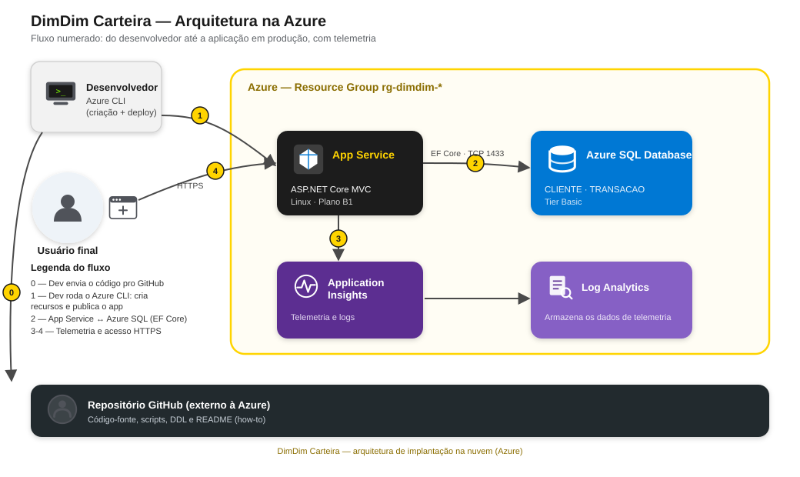

# DimDim Carteira

Web app para gerenciar **clientes** e suas **transações de pagamento** (PIX, boleto, cartão), desenvolvido para o 2º Checkpoint de DevOps Tools & Cloud Computing.

## 1. Descrição da solução

O DimDim Carteira resolve um problema simples: acompanhar quem são os clientes de uma carteira digital e quais transações (PIX, boleto ou cartão) cada um realizou, com status (pendente, pago, cancelado).

**Público-alvo:** pequenos negócios ou autônomos que precisam de um controle básico de clientes e cobranças, sem depender de planilhas.

**Funcionalidades:**
- CRUD completo de **Clientes** (listar, criar, editar, detalhar, excluir).
- CRUD completo de **Transações**, vinculadas a um cliente (listar com nome do cliente, criar, editar, detalhar, excluir).
- Página inicial com resumo: total de clientes, total de transações e soma dos valores.

## 2. Arquitetura



| Recurso Azure | Função |
|---|---|
| **App Service (Linux, plano B1)** | Hospeda a aplicação ASP.NET Core MVC |
| **Azure SQL Database (tier Basic)** | Armazena as tabelas `CLIENTE` e `TRANSACAO` |
| **Application Insights** | Coleta telemetria de requisições, dependências e logs customizados da aplicação |
| **Log Analytics Workspace** | Armazena os dados coletados pelo Application Insights |
| **Resource Group** | Agrupa todos os recursos acima (`rg-dimdim-<sufixo>`) |

O usuário acessa a aplicação via HTTPS no App Service, que se conecta ao Azure SQL via Entity Framework Core (porta 1433) e envia telemetria para o Application Insights. O deploy é feito via Azure CLI (`az webapp deploy`), a partir da máquina do desenvolvedor ou de um workflow do GitHub Actions.

## 3. Tecnologias

- **ASP.NET Core MVC** (.NET 10 LTS)
- **Entity Framework Core** + `Microsoft.EntityFrameworkCore.SqlServer`
- **Azure SQL Database** (PaaS)
- **Azure App Service** (Linux)
- **Application Insights** (`Microsoft.ApplicationInsights.AspNetCore`)
- **Azure CLI** para provisionamento e deploy
- Bootstrap (tema customizado amarelo/preto do DimDim)

## 4. Modelo de dados

Relação 1:N entre `CLIENTE` e `TRANSACAO`:

```
CLIENTE (1) ───< (N) TRANSACAO
```

DDL completo em [`scripts/01-ddl.sql`](scripts/01-ddl.sql).

| Tabela | Principais colunas |
|---|---|
| `CLIENTE` | Id, Nome, Email (único), Telefone, DataCadastro |
| `TRANSACAO` | Id, ClienteId (FK), Descricao, Valor, Tipo (PIX/BOLETO/CARTAO), Status (PENDENTE/PAGO/CANCELADO), DataTransacao |

## 5. How-to de implantação

### Pré-requisitos

- [Azure CLI](https://learn.microsoft.com/cli/azure/install-azure-cli) instalado e autenticado (`az login`)
- Extensão `application-insights`: `az extension add -n application-insights`
- [`sqlcmd`](https://learn.microsoft.com/sql/tools/sqlcmd/sqlcmd-utility) instalado
- [.NET SDK](https://dotnet.microsoft.com/download) (versão compatível com o runtime do App Service — conferir com `az webapp list-runtimes --os linux`)
- Git

### Passo a passo

1. **Clonar o repositório**

   ```bash
   git clone <url-do-repositorio>
   cd dimdim-carteira
   ```

2. **Ajustar as variáveis**

   Edite `scripts/00-variaveis.sh` e defina um `SUFIXO` único (os nomes do SQL Server e do Web App precisam ser únicos globalmente na Azure) e a `LOCATION` (confira as regiões liberadas pela política da sua assinatura — nem toda assinatura aceita todas as regiões).

   Exporte a senha do SQL antes de rodar os scripts (nunca commitar a senha):

   ```bash
   export SQL_PASSWORD='SuaSenhaForte#2026'
   ```

3. **Criar os recursos na Azure**

   ```bash
   bash scripts/02-criar-recursos.sh
   ```

   Cria Resource Group, Azure SQL Server + Database, Log Analytics, Application Insights, App Service Plan e Web App, além de configurar a connection string e a chave do Application Insights como App Settings do Web App.

4. **Aplicar o DDL no banco**

   ```bash
   bash scripts/03-aplicar-ddl.sh
   ```

5. **Rodar localmente para validar (opcional)**

   ```bash
   cd src/DimDim.Web
   dotnet user-secrets init
   dotnet user-secrets set "ConnectionStrings:DefaultConnection" "<connection string do Azure SQL>"
   dotnet user-secrets set "ApplicationInsights:ConnectionString" "<connection string do Application Insights>"
   dotnet run
   ```

   Rodar local contra o Azure SQL é só para desenvolvimento — a entrega final precisa estar publicada no App Service.

6. **Publicar e fazer o deploy**

   ```bash
   bash scripts/04-deploy.sh
   ```

   > No Windows, se o `zip` não estiver disponível, publique com `dotnet publish src/DimDim.Web -c Release -o publish` e gere o `.zip` garantindo que os caminhos internos usem `/` (barra normal) e não `\`, pois o App Service roda em Linux. Em seguida: `az webapp deploy --resource-group <rg> --name <webapp> --src-path publish.zip --type zip`.

7. **Acessar e testar**

   Abra `https://<nome-do-webapp>.azurewebsites.net` e teste o CRUD de Clientes e Transações.

8. **Ver o Application Insights**

   No portal do Azure, abra o recurso Application Insights do grupo e consulte **Live Metrics** (dados em tempo real) ou **Transaction search / Logs** (consultas como `requests` e `traces` em Kusto/KQL) para ver as requisições e os logs customizados da aplicação (ex.: "Cliente criado", "Transação excluída").

9. **Excluir todos os recursos** (ao final do curso, para não gerar custo)

   ```bash
   az group delete --name <nome-do-resource-group> --yes --no-wait
   ```

## 6. Deploy via GitHub Actions (opcional)

Workflow em [`.github/workflows/deploy.yml`](.github/workflows/deploy.yml). Requer o secret `AZURE_WEBAPP_PUBLISH_PROFILE` no repositório (obtido com `az webapp deployment list-publishing-profiles --xml`) e o ajuste do nome do Web App e da versão do .NET no próprio arquivo.

## 7. Vídeo

Link: _a preencher_

## 8. Integrantes

| Nome | RM |
|---|---|
| Bruno Vinicius Barbosa | 566366 |
| _a preencher_ | _a preencher_ |
